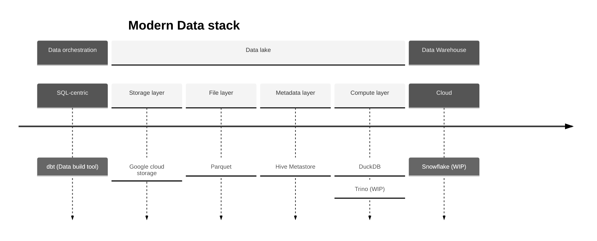
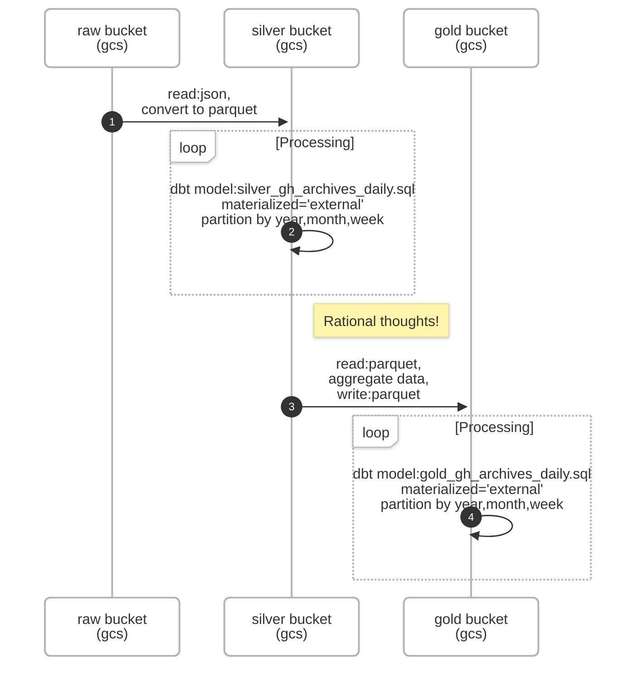

### Using the starter project
To run the project: dbt run, dbt test

## Resources:
- Learn about dbt [in the docs](https://docs.getdbt.com/docs/introduction)
- Learn about DuckDB [in the docs](https://duckdb.org/docs/stable/index)

