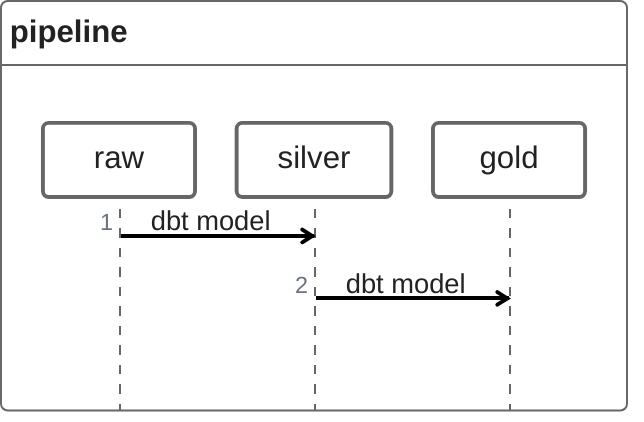

This is the place for me to experiment with modern data stack. 
Currently I have used DBT to ingest and process files using medallion architecture with DuckDB as the compute layer.

### Using the starter project
To run the project:
- dbt run
- dbt test

### Resources:
- Learn more about dbt [in the docs](https://docs.getdbt.com/docs/introduction)
- Learn more about DuckDB (https://www.pracdata.io/p/duckdb-beyond-the-hype)

